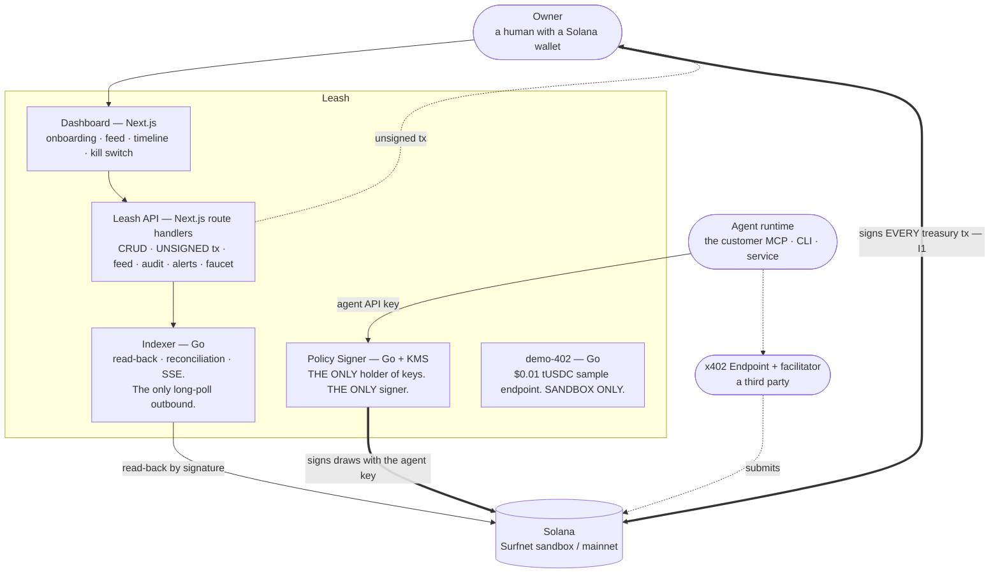
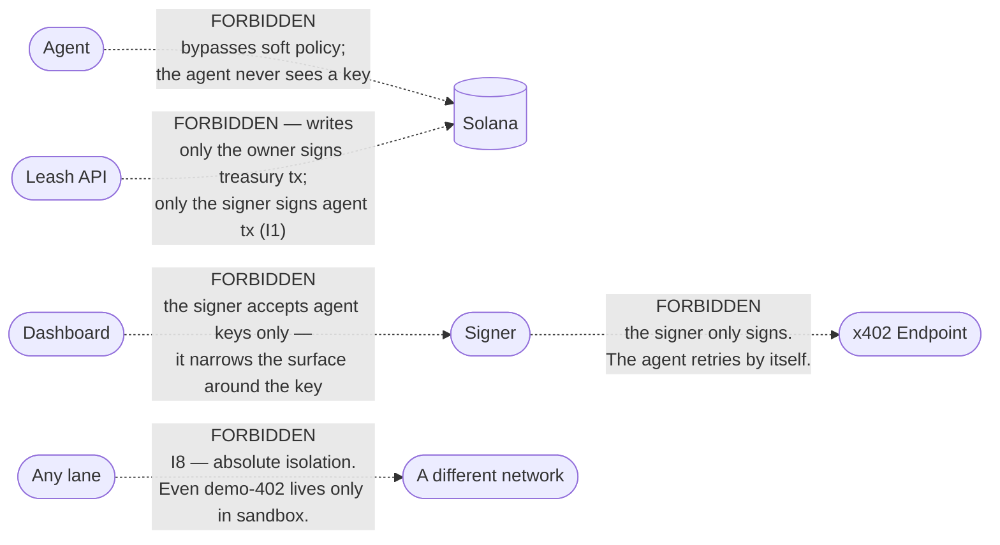

# Lanes, and the edges that are forbidden

Five components. What each is responsible for, and — the half that matters — what each may
**never** do. Prose: [01-architecture.md](../01-architecture.md), deck chapters 4 and 6.

Thick arrows are the only two paths by which anything is ever signed. **The owner's wallet signs
every transaction that touches the treasury. The signer signs draws, and nothing else.** No Leash
process ever holds an owner key.

## Responsibilities, and prohibitions

| Component | Responsible for | May **never** |
|---|---|---|
| **Dashboard** | Five-step onboarding, sandbox/mainnet switch, feed + timeline, kill switch, one-tap recovery, top-up, audit | Hold a key · compute a balance itself · write directly to RPC |
| **Leash API** | Agent/policy/template CRUD, **unsigned** transactions, feed/timeline/audit, alerts, the sandbox faucet, export jobs | **Sign anything** · touch an agent key · mix networks in one unfiltered query (I8) |
| **Policy Signer** | Agent keys, S0–S7, signing draws inside an allowance, handshake phases 1–3. **The only key holder, the only signer** | Hold an owner key (I1) · make an outbound HTTP call in the signing path · sign a challenge whose network differs from the key's (I8) · **be reachable from the dashboard** |
| **Indexer** | Read-back per network, reconciliation, alert evaluation, handshake phases 5–6. The only outbound long-poll | Infer `confirmed` from an HTTP response (I4) · modify an append-only collection |
| **demo-402** | A sample x402 endpoint at $0.01 tUSDC for onboarding step 5; verifies and submits to Surfnet itself | Take mainnet traffic |

## The forbidden edges, drawn

## The absolute prohibition

**An agent key and an owner key never live in the same process.** Unchanged since deck v1, and
the reason the signer is a separate deployable rather than a module.

New in v3: **one signer process serves both networks**, but the key reference is always looked up
by `(agent, network)`. There is no function that takes only an agent identifier, so there is no
code path that can fetch a mainnet key for a sandbox challenge.

## The prohibitions that are checked rather than promised

Two of the rules above are enforced by the build, not by review:

- `internal/api` importing `internal/signer` **fails the build** — that is *"the dashboard cannot
  reach the signer"* expressed in the dependency graph, so it cannot be lost in a migration.
- Nothing under `frontend/website` may import an AWS KMS client. There is no key material in that
  deployable, and the check is what says so. [13-testing.md](../13-testing.md).

And one that no checker can express, because the browser is not in the build graph: *"the browser
cannot reach the signer"* is a **deployment** fact — no public route from the dashboard's origin,
agent-key authentication only, no CORS entry for the dashboard. **The post-deploy smoke test
asserts it** by making a browser-shaped request and requiring it to fail.
