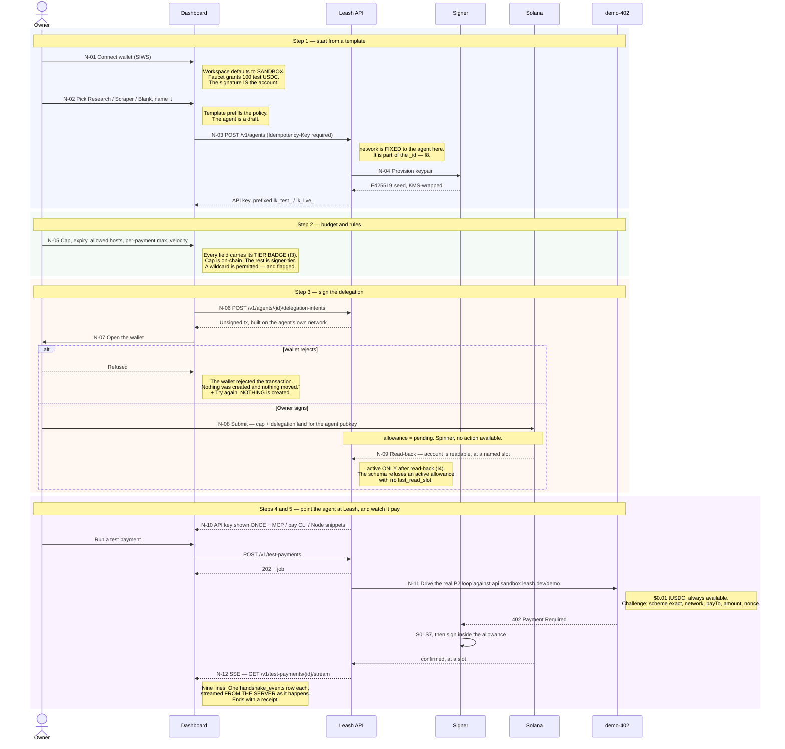
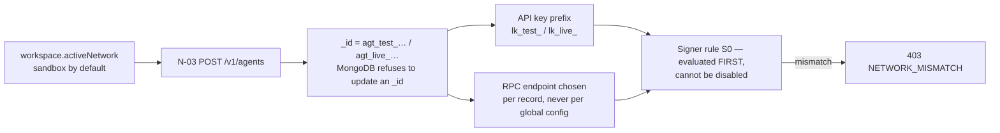

# P1 · Onboard, delegate, and pay — N-01 … N-12

**The target the whole phase is built around:** a brand-new wallet to an agent paying a real API
within a $10 budget, in **under ten minutes** of setup.

Sandbox-first. The workspace starts on Surfnet with play-money USDC, and nothing real happens
until the owner switches. Prose: [09-flows.md](../09-flows.md#p1--onboard-delegate-and-pay--five-steps).

## The two steps that are most often got wrong

**N-12 — the temptation is to fake the log in the frontend.** The prototype does exactly that,
and it is the one thing that must not survive the port. A scripted animation is a demonstration
that the product works, shown to a user for whom it might not. The nine lines must be real, one
event per `handshake_events` row, streamed over SSE as the loop actually runs on Surfnet.

**N-09 — the temptation is to call it `active` on submit.** `submitted` is not `confirmed`. The
only transition into `active` is a read-back, and the copy says so:

> Waiting for on-chain confirmation… Submitted is not confirmed — this flips the moment the
> allowance is readable on Solana.

**N-07 exists because the deck insists the rejection path is built, not just the happy one.** An
interface that only handles success teaches its user that a refusal is a bug.

## One wizard, two networks, no bleed

The mechanism that makes I8 hold across this whole phase is that `network` is chosen once, at
N-03, and is then a property of the identifier itself:

The key reference inside the signer is always looked up by **`(agent, network)`**. There is no
function that takes only an agent identifier — which means there is no code path that can fetch a
mainnet key for a sandbox challenge. [06-signer.md](../06-signer.md).
