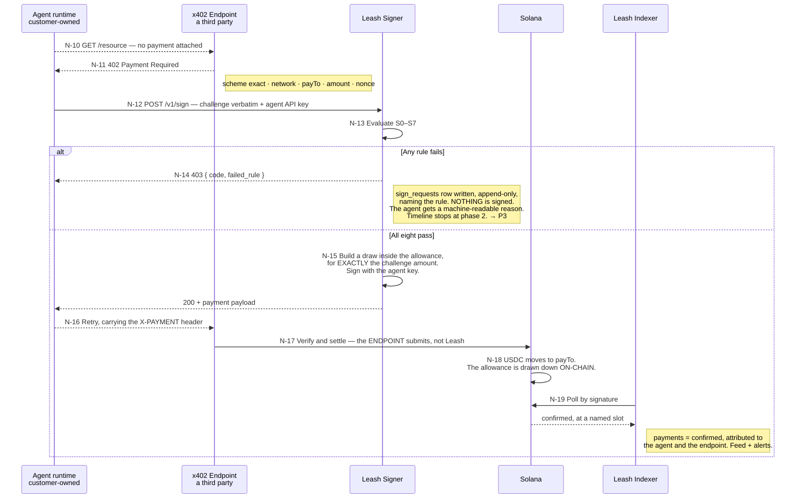
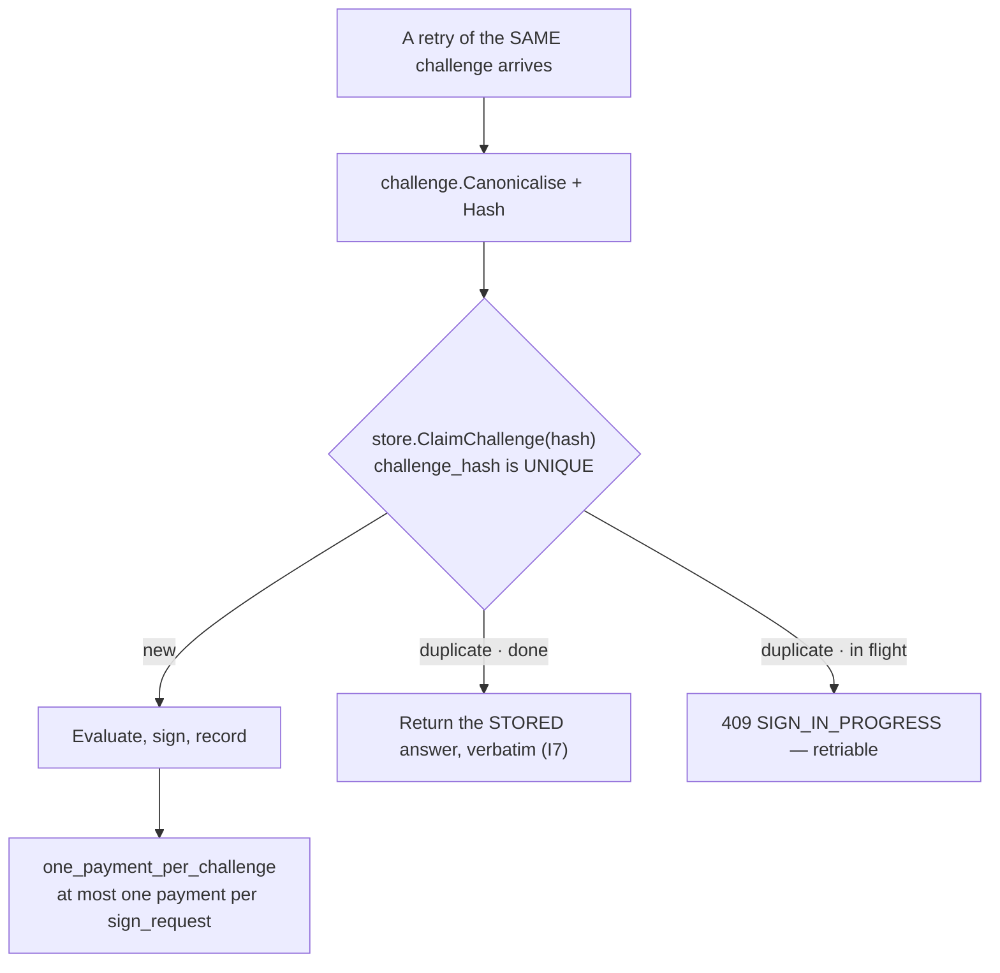
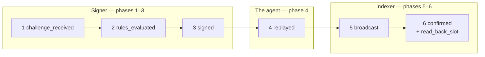

# P2 · The agent pays — N-10 … N-19

The loop that runs unattended, thousands of times. Everything else in Leash exists to make this
loop safe to leave alone. Prose: [09-flows.md](../09-flows.md#p2--the-agent-pays--n-10--n-19).

Dashed arrows are hops Leash neither performs nor controls: they happen inside the customer's
agent, or inside a third party's endpoint.

## Three things this diagram is drawn to make impossible to misread

**The agent never sees a key, and never submits its own transaction.** `Agent → Solana` is a
forbidden lane edge ([lanes.md](lanes.md)). Every draw is signed inside the signer, and the
endpoint — not Leash — is what broadcasts it.

**Leash never retries on the agent's behalf.** N-16 is the agent's own decision, on its own
cadence. `Signer → x402 endpoint` is likewise a forbidden edge. A retry we initiated would be a
payment the customer did not ask for.

**`confirmed` comes only from N-19.** Never from the HTTP response at N-16, never from the
endpoint saying so. That is I4, and the database enforces it: only the indexer may write the
`confirmed` phase.

## The double-payment trap

Called out in the deck and unchanged since v1. Two mechanisms, both at the storage layer, because
enforcement in application code is enforcement that a second caller can skip:

And the other half of the same trap: a payment stuck in `submitted` or `unknown` **escapes only
by read-back on its signature — never by signing again.** [state-machines.md](state-machines.md).

## The timeline is data, not a re-render of a log

New in deck v3: every step of this loop writes a `handshake_events` row, so the drawer's timeline
is first-class data rather than prose reconstructed after the fact.

| Phase | Written by | Note |
|---|---|---|
| 1–3 | **Signer**, with each S0–S7 result in `detail` | Written **after** the verdict is returned — fire-and-forget. Putting an audit write on a payment's critical path is a merge gate |
| 4 | Usually **nobody** | It happens inside the customer's agent and is unobservable. It renders **dimmed**. Fabricating a timestamp for it would be inventing evidence in an audit trail |
| 5–6 | **Indexer**, from read-back, with the slot | `confirmed` is the indexer's alone, enforced by the database |

`one_phase_per_payment` is unique — a phase is written once or not at all.

**Blocked** → the timeline stops at phase 2 with `failed_rule`, and the drawer says *"5 other
checks not reached"* plus the two recovery buttons. **Unknown** → phase 5 exists, phase 6 does
not; the drawer shows a spinner and the time of the next read-back.
