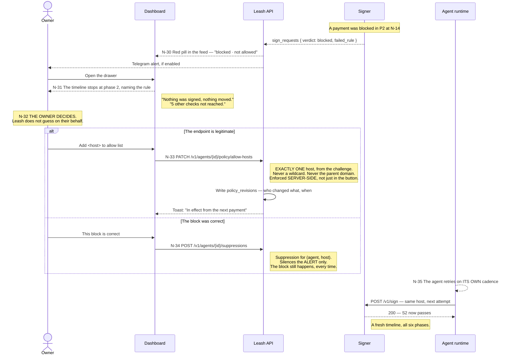
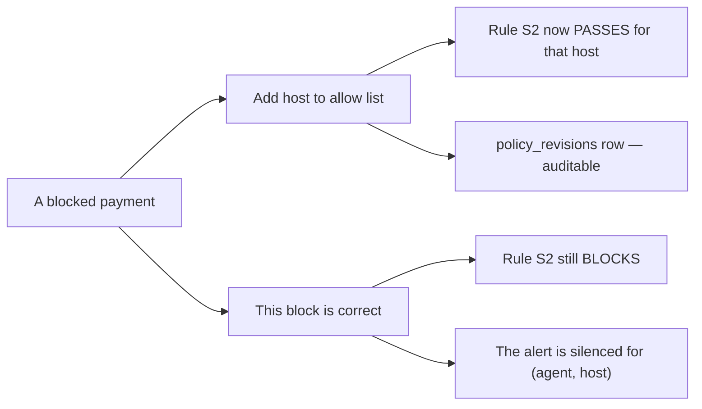

# P3 · Monitoring and recovery — N-30 … N-35

The flow that turns a block from a dead end into a one-tap fix. New in deck v3, taken from
prototype v2. Prose: [09-flows.md](../09-flows.md#p3--monitoring-and-recovery--n-30--n-35).

## The trap the deck names for this flow

**The one-tap button must add only the exact host from the challenge.** Not a wildcard, not
`*.unknown.xyz`, not the registrable domain. Broadening beyond one host is a decision the owner
makes deliberately on the Rules tab — it is not something a recovery button does on their behalf.

It is enforced server-side as well as in the interface, **because the button is not the only
caller** ([05-api-contract.md](../05-api-contract.md)).

## Two things that look similar and are not

A suppression is not a permission. Conflating the two would mean an owner who wanted to stop
being paged had quietly opened a spending path instead.

## Policy changes are never retroactive

`N-35` is the agent's own retry, on its own schedule. Leash does not replay a blocked payment —
that would cross a forbidden lane edge, and it would be a payment the customer did not ask for.
The drawer copy is fixed and says exactly this:

> If this endpoint is legitimate, allow it and the agent's next attempt will go through.

and the toast afterwards: *"In effect from the next payment."*
