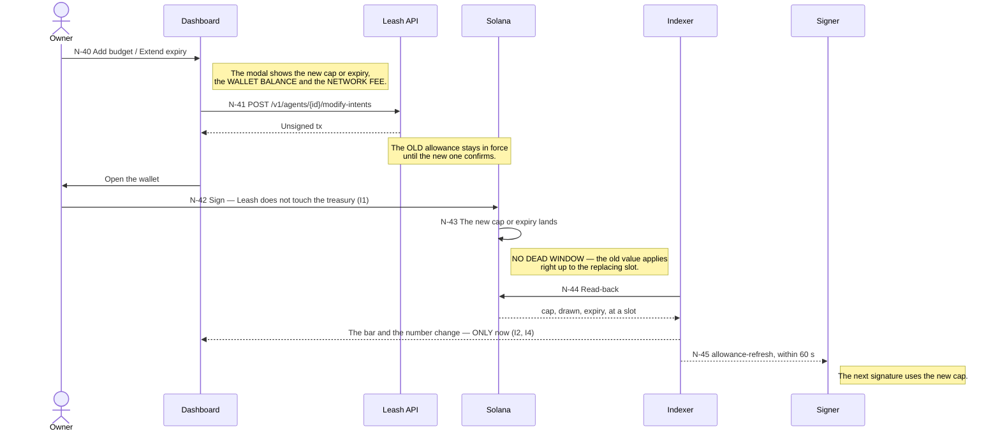
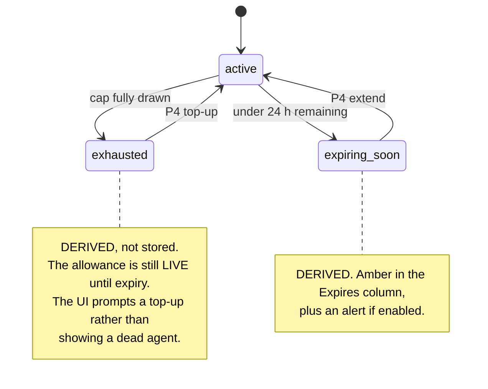
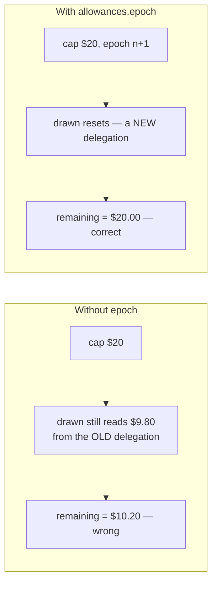

# P4 · The budget lifecycle — N-40 … N-45

New in deck v3. Top up a cap, or extend an expiry, **without a dead window**. Prose:
[09-flows.md](../09-flows.md#p4--the-budget-lifecycle--n-40--n-45).

## Two derived states, computed at query time and never stored

Storing them would mean a cached truth about money, which is exactly what I2 exists to forbid.

## The trap under the SPL implementation

The MVP does **not** write a new program. It wraps an existing one through an adapter — and the
adapter that actually ships is the SPL `approve`/`revoke` delegate fallback, not the
Subscriptions & Allowances primitive the deck assumed ([08-onchain-adapter.md](../08-onchain-adapter.md),
[adapter.go](../../backend/internal/chain/adapter.go)).

That changes what a top-up *is*:

> **A top-up REPLACES the delegation rather than adding to it**, so the new cap arrives with a
> fresh drawn counter. `allowances.epoch` carries this. Without it, the amount already spent would
> be counted against the new cap — and the owner who topped up $10 → $20 would find they had
> bought themselves nothing.

And the honest consequence of the same fallback, per I3: **expiry is not enforced on-chain.** It
is a signer-tier rule, and the interface must label the Expires field *signer*, not *on-chain*.
A controlled downgrade, declared before the sprint rather than argued about during it.
