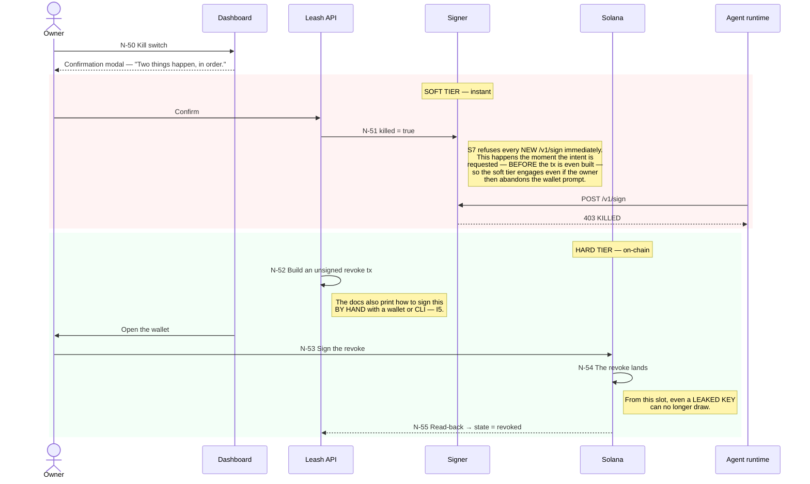
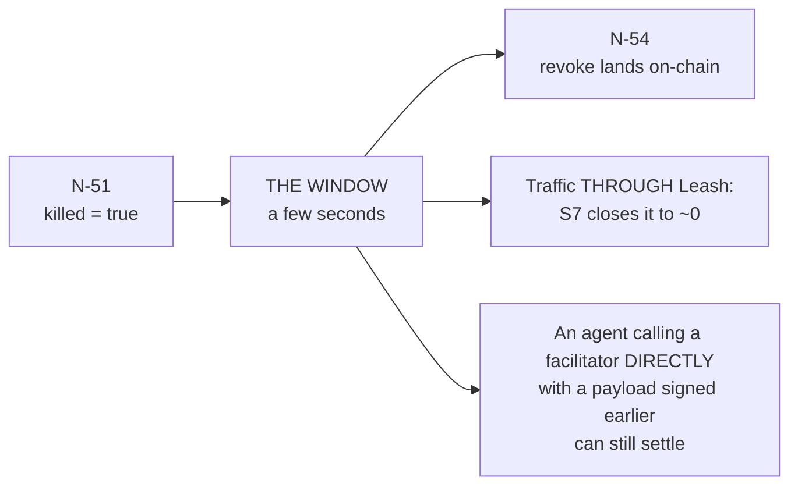
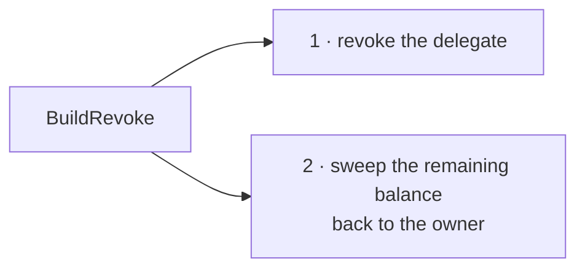

# P5 · Kill and revoke — N-50 … N-55

Two tiers, in order, **and the interface says so before the owner confirms**. Prose:
[09-flows.md](../09-flows.md#p5--kill-and-revoke--n-50--n-55).

## The revoke window is the nature of the chain, not a bug

**Saying `revoked` before the read-back is the trap the deck names for this flow, and it is on the
reject-merge-if list.** It would tell an owner that a compromised agent is contained at a moment
when it is not yet. The interface keeps saying `revoking…` until N-55, and the kill button is
relabelled `Revoke pending` and disabled.

The modal copy is fixed:

> **Instantly:** The signer refuses every new payment from this agent.
> **On-chain:** Your wallet signs a revoke — once confirmed, the allowance is gone even if Leash
> is offline.

That second sentence is invariant **I5** written as product copy. Revoke is a transaction the
owner signs directly against the chain; it does not need Leash to be running, and
[if-leash-is-down.md](../if-leash-is-down.md) publishes the manual procedure.

## What `BuildRevoke` actually emits

Under the SPL implementation, **two** instructions, not one:

The sweep exists because the SPL fallback moves the owner's funds into a per-agent token account
they still own. Revoking the delegation without sweeping would leave money stranded in an account
with no delegate. [08-onchain-adapter.md](../08-onchain-adapter.md).

## Blast radius

The bound this whole flow exists to guarantee: **a leaked agent key is worth the remaining balance
of that one allowance.** Not the cap — the remaining. That bound is the product, and it is why
the runbook for a suspected leak is calm: kill switch, then on-chain revoke, then rotate.
[12-security.md](../12-security.md).
