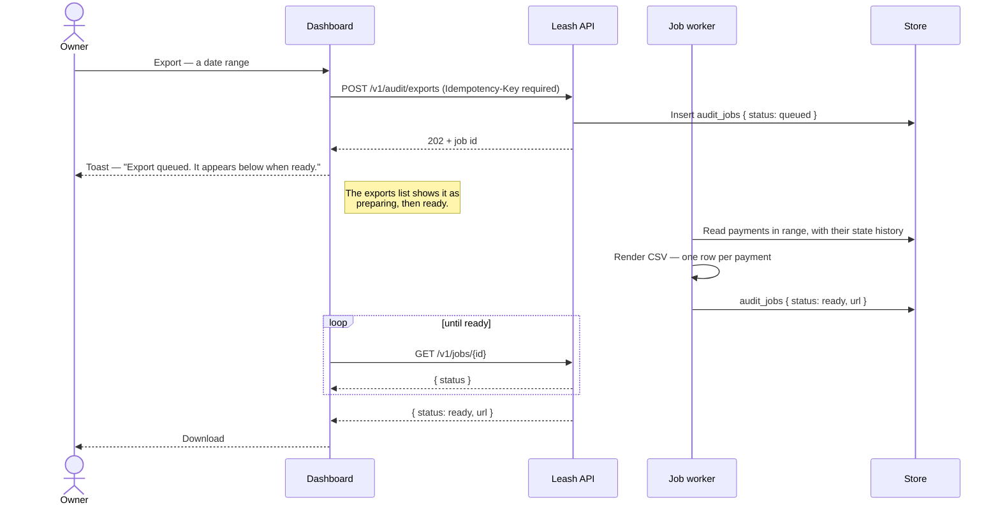

# P6 · Audit export

Always asynchronous. Always `202`. There is no synchronous variant to fall back to, because a
range large enough to matter is a range large enough to time out.

## One CSV row per payment

The agent, the endpoint, the amount, the status history, and **the on-chain signature** — the
last of which is what makes the export an audit trail rather than a report. Every row can be
checked against the chain by someone who does not trust Leash, which is the only kind of audit
trail worth exporting.

Amounts come out of `amount_base`, integer micro-USDC (I6). A float anywhere in this path would
make the export disagree with the chain by cents that accumulate.

## The copy is fixed

> Large ranges take a minute. The export is prepared in the background — the button queues it,
> this list shows it when it's ready.

and the toast: *"Export queued. It appears below when ready — nothing to wait on."*

Both sentences do the same job: they promise the owner there is nothing to sit and watch. An
interface that returns `202` while looking like it is loading has told the truth in the protocol
and lied in the pixels.

## What is append-only underneath

The export reads collections the application cannot rewrite. `sign_requests`,
`handshake_events` and `policy_revisions` have `UPDATE` and `DELETE` revoked at the database
role; `payments` has `DELETE` revoked ([03-data-model.md](../03-data-model.md)). An audit trail
whose writer can edit it is not an audit trail — the export is only as good as that privilege
grant, which is why `verify-constraints` proves it against MongoDB rather than trusting the code.
