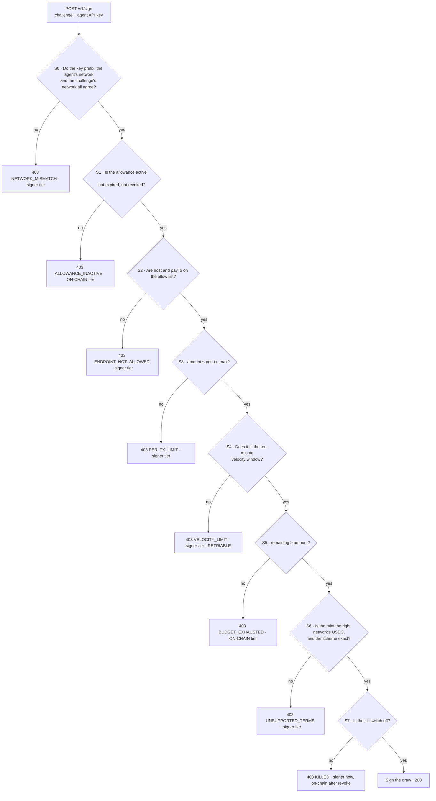
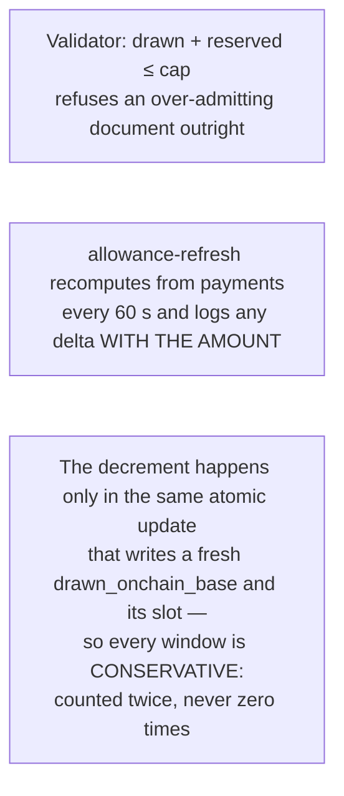
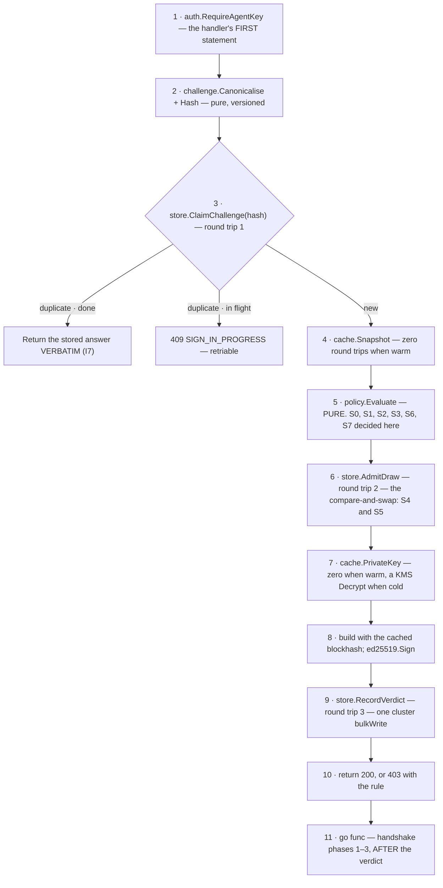

# The policy engine — S0–S7, and the signing path

Eight rules. **Any failure blocks.** Evaluation order is part of the contract, because the SDK
branches on the returned code — a killed agent whose challenge also has a network mismatch must
always report the same one. Prose: [04-policy-engine.md](../04-policy-engine.md).



**The order of the constants IS the evaluation order, and the evaluation order is part of the
contract** ([rule.go](../../backend/internal/domain/policy/rule.go)). On the first failure,
everything after it is reported as `NotReached` — not as a pass, which would imply it was
evaluated, and not as a failure, which would be false. That is what the drawer's *"5 other checks
not reached"* is rendered from.

**S4 and S5 are decided twice, and the second time is the one that counts.** `policy.Evaluate` is
pure and reads them off a cached snapshot; the signer then re-decides both inside a single atomic
compare-and-swap at the store, where a concurrent request cannot slip between the read and the
write. The pure pass keeps the reported order honest; the atomic pass keeps the money honest.

## The eight rules

| # | Checks | Tier (I3) | Code | Can be turned off? |
|---|---|---|---|---|
| **S0** | Key prefix matches the agent's network; the challenge's network matches too | signer | `NETWORK_MISMATCH` | **no** |
| **S1** | Allowance active, not expired, not revoked | **on-chain** | `ALLOWANCE_INACTIVE` | **no** |
| **S2** | Host and `payTo` on the allow list — a wildcard is permitted, and flags the agent | signer | `ENDPOINT_NOT_ALLOWED` | yes |
| **S3** | `amount ≤ per_tx_max` | signer | `PER_TX_LIMIT` | yes |
| **S4** | Velocity, in a ten-minute window | signer | `VELOCITY_LIMIT` | yes |
| **S5** | `remaining ≥ amount` | **on-chain once the chain catches up** | `BUDGET_EXHAUSTED` | **no** |
| **S6** | Mint is the right network's USDC; scheme is `exact` | signer | `UNSUPPORTED_TERMS` | **no** |
| **S7** | Kill switch is off | signer instantly, **on-chain** after the revoke lands | `KILLED` | yes |

**S0 is evaluated first and cannot be disabled.** A network mismatch means every later comparison
would be made against the wrong world, so nothing after it is meaningful. The golden vector for
this is explicit: a killed agent *and* a network mismatch must report `NETWORK_MISMATCH`
([contracts/policy-vectors/S0.json](../../contracts/policy-vectors/S0.json)).

## The budget arithmetic

```
remaining = cap_base − drawn_onchain_base − Σ amount_base(payments ∈ {signed, submitted, unknown})
```

Integer micro-USDC throughout — no float at any tier (I6). The in-flight sum is **materialised**
as `allowances.reserved_base` so that S4 and S5 can be decided inside a single conditional
`findOneAndUpdate` whose predicate lives in the **filter**, rather than in a read-then-write.

**When several requests race for the remainder: FIFO by signing time.** The overflow gets
`403 BUDGET_EXHAUSTED`.

A materialised total can drift where a live `SUM()` cannot. Three defences, none of which removes
the risk:



## The signing path, in order

Three synchronous round trips, 6–15 ms of database at `w:majority`.



**Step 11 comes after step 10, and that ordering is a merge gate.** Writing the timeline before
returning the verdict would put an audit write on the critical path of a payment. The queue is
**bounded** — an unbounded one turns a database stall into an out-of-memory kill. On a full queue
the event is dropped and a counter increments: a lost timeline row is an audit gap to alarm on,
not a reason to fail a payment that has already been signed and returned.

## The latency budget

| Hop | p50 | p99 |
|---|---|---|
| Parse, canonicalise, idempotency | 5 ms | 15 ms |
| `evalPolicy` S0–S7 | 10 ms | 30 ms |
| KMS unwrap | 20 ms | 80 ms |
| Build and sign, blockhash cached 30 s per network | 15 ms | 40 ms |
| **Total added** | **< 50 ms** | **< 300 ms** |

**Forbidden, and a PR is rejected for either:** an outbound HTTP call inside the signing path, or
writing handshake phases 1–3 before the verdict is returned.

## Why the rules are a pure package

`policy.Evaluate` takes a snapshot, a request and a clock, and returns a verdict. No I/O. That is
what makes the golden vectors possible — [contracts/policy-vectors/](../../contracts/policy-vectors/)
is executed by the Go engine **and** by the TypeScript renderer of blocked verdicts, against the
same JSON files — and it is what will let the V2 self-hosted sidecar reuse the engine unchanged.
