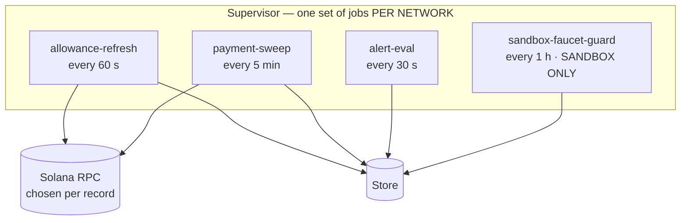
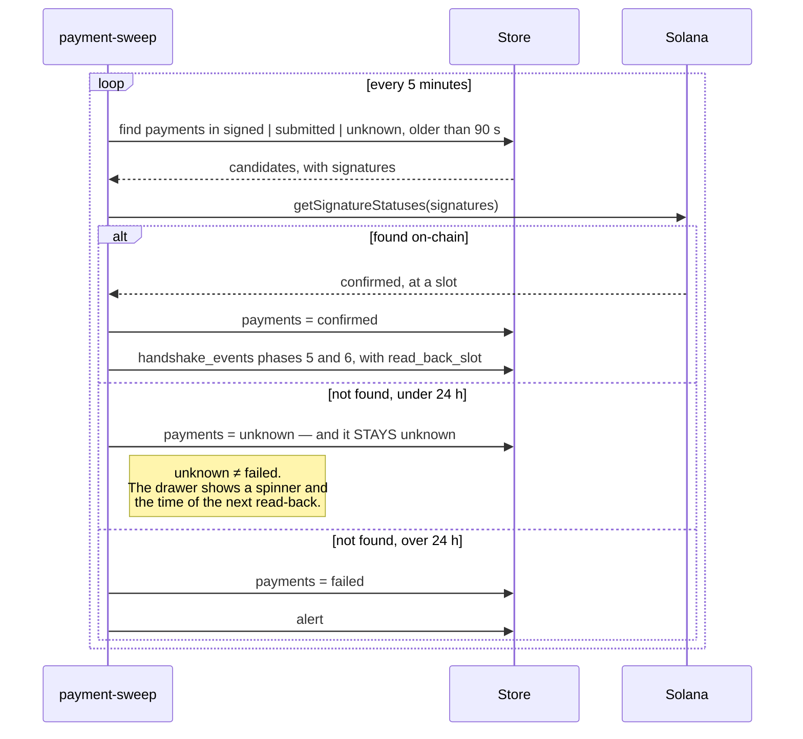

# Reconciliation — the four loops

The indexer is the only component that long-polls outbound, and the only one permitted to write
`confirmed`. Each loop is spawned **once per configured network**. Prose:
[07-indexer-and-jobs.md](../07-indexer-and-jobs.md).



| Job | Every | Does |
|---|---|---|
| `allowance-refresh` | 60 s | Re-reads active allowance accounts; updates `drawn_onchain_base` and `last_read_slot`; catches expiries and revocations that happened out of band; recomputes `reserved_base` and **reports drift with the amount** |
| `payment-sweep` | 5 min | `signed \| submitted \| unknown` older than 90 s → check by signature. Older than 24 h with no trace → `failed`, plus an alert. Writes handshake phases 5–6 |
| `alert-eval` | 30 s | Burn rate at 80% and 95%; unusual blocks minus suppressions; a never-seen endpoint; an allowance expiring within 24 h |
| `sandbox-faucet-guard` | 1 h | Rate-limits the faucet per wallet. Sandbox only — **spawning it for mainnet is a configuration error, and the boot says so** |

**Per network, not iterating networks inside the body.** A job that loops over networks in its own
body is one `if` away from reading a sandbox record with a mainnet RPC client. The network is
bound at spawn time, lives in the closure, and appears in every log line the job emits (I8).

## How a payment escapes `unknown`



**There is no branch here that re-signs.** A payment leaves `signed`, `submitted` or `unknown`
only by being found — or by ageing out with an alert. A retry path that skipped the read-back is
how a system pays twice for one challenge, which is invariant I4 and I7 together.

## Degraded mode — the lag is a number, not an apology

When read-back falls behind, the system says so rather than hiding it:

```
GET /v1/health/chain → { "sandbox": { "lag_seconds": 14, "degraded": true, "using": "fallback" } }
```

and the dashboard raises the banner:

> On-chain data is lagging 14s behind — balances may be stale. Payments are unaffected.

Three things in that sentence are load-bearing. It **states the lag as a number** rather than a
vague apology. It says **balances may be stale**, which is honest about I2. And it says
**payments are unaffected**, which is true — the signer's admission depends on its cached snapshot
and the atomic compare-and-swap, not on the indexer being current.

**Hiding this banner for aesthetic reasons is listed as forbidden** in
[10-ui-spec.md](../10-ui-spec.md).

## Drift, and why it is logged with the amount

`reserved_base` is a materialised total, and a materialised total can drift where a live `SUM()`
cannot. Every drift is either a refused payment that should have gone through, or — worse — an
admitted one that should not have been.

`allowance-refresh` recomputes it from the payments every 60 seconds and logs any delta **with the
amount**, because a drift alert that does not say how much is an alert nobody can triage. The
validator's `drawn + reserved ≤ cap` is the backstop: the admission filter cannot over-admit even
if it is wrong. [16-deck-conformance.md](../16-deck-conformance.md) §B-3 names this as the
deviation to worry about first.
