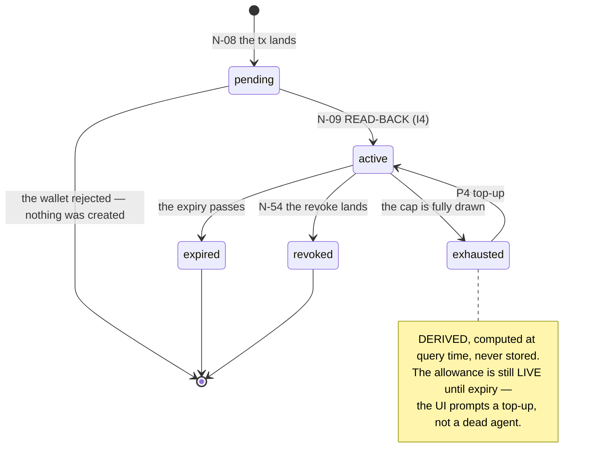
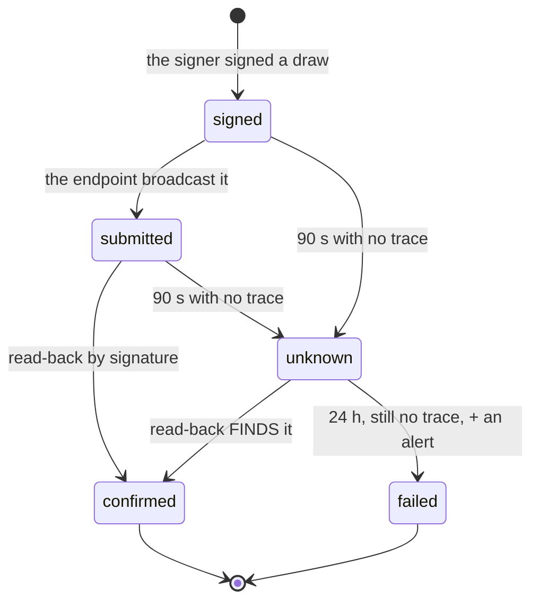
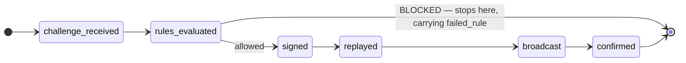
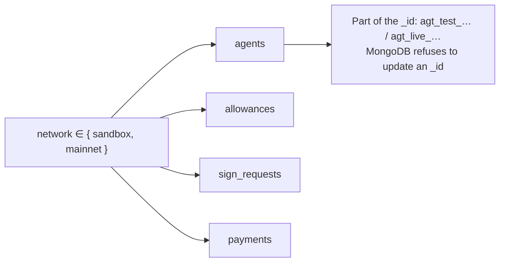

# The state machines

Three axes, kept strictly separate — allowance, payment, verdict — plus a fourth added in deck v3
that is independent of all of them: **network**. Merging any two of these enums is a data-model
error, and the deck says so in as many words.

## Allowance

**`pending → active` happens only through a read-back.** There is no other transition into
`active`, and the schema refuses an `active` allowance with no `last_read_slot`. An allowance that
claims to be live without naming the slot it was read at is a number the owner cannot check, which
is invariant I2 as a validator rather than as a promise.

`pending` and `active` are the two states subject to `one_active_allowance` — at most one per
`(agent, mint)`. The transition out of them removes the materialised key in the same update that
changes the state ([03-data-model.md](../03-data-model.md)).

## Payment

**Every exit from `signed`, `submitted` and `unknown` is a read-back.** There is no transition
that re-signs, and none that infers. `unknown` is not `failed` — that distinction is invariant I4,
and collapsing them is how a system pays twice for one challenge.

The state moves are driven by `payment-sweep` ([reconciliation.md](reconciliation.md)).

## The handshake — six phases

| Phase | Written by | |
|---|---|---|
| 1 `challenge_received` · 2 `rules_evaluated` · 3 `signed` | **Signer** | Each S0–S7 result goes into `detail`. Written **after** the verdict returns — fire-and-forget |
| 4 `replayed` | usually **nobody** | It happens inside the customer's agent and is unobservable. Rendered **dimmed** |
| 5 `broadcast` · 6 `confirmed` | **Indexer** | From read-back, carrying `read_back_slot` |

`one_phase_per_payment` is unique: a phase is written once, or not at all.

**Only the indexer may write `confirmed`, and the database enforces it.** Phase 4 is the one the
deck is most insistent about: *fabricating a timestamp for it would be inventing evidence in an
audit trail.* An unobservable step is drawn as unobservable.

Three renderings fall out of the machine directly:

- **Blocked** → the timeline stops at phase 2 with the rule named, *"nothing was signed, nothing
  moved"*, and the two P3 recovery buttons.
- **Unknown** → phase 5 exists, phase 6 does not. A spinner, and **the time of the next
  read-back** — a number, not an apology.
- **Confirmed** → phase 6 with its slot, which is what makes the row checkable against the chain
  by someone who does not trust Leash.

## The fourth axis — network

It is **not** a state — nothing transitions between sandbox and mainnet. It is fixed at creation
and immutable thereafter, which is why it is carried in the identifier rather than in a mutable
field. An `$expr` validator pins the `network` field to the prefix, and the same validator ties a
*referenced* identifier's prefix to the referencing document's network — so a mainnet payment
cannot point at a sandbox agent. That cross-collection check is the composite foreign key
PostgreSQL would have needed; here it is a property of the storage engine.
